<!-- 
  ╔══════════════════════════════════════════════════════════════╗
  ║  KAUSTUV MISHRA · GitHub Profile                             ║
  ║  Custom animated SVGs live in /assets                        ║
  ║  Palette · Gold #F5D061 · Obsidian #0A0A0A · Steel #A6B4C8   ║
  ╚══════════════════════════════════════════════════════════════╝
-->

<!-- ░░░ HERO ░░░ -->

  

  

<!-- ░░░ DIVIDER ░░░ -->

## 🌐 Executive Summary

I am an **AI Engineer and Full Stack Architect** who loves solving complex problems through intelligent design. I focus on building enterprise-grade AI models for massive datasets and architecting highly scalable web applications, including custom complaint trackers and logic-driven engines. I specialize in bridging the gap between advanced machine learning and seamless user experiences.

- 🔭 **Current Focus** — Pioneering large-scale AI applications, optimizing complex data systems, and deploying robust cloud architectures.
- 💼 **Domain Expertise** — Designing intelligent lead generation ecosystems, automating data pipelines, and handling sensitive datasets with high availability.
- 🌱 **Continuous Evolution** — Deep-diving into advanced ML methodologies, sophisticated DevOps pipelines, and multi-cloud scaling across AWS, GCP, and Azure.
- ⚡ **The Human Element** — Over a decade in martial arts and MMA fuels a rigorous, disciplined approach to problem-solving.

 

<!-- ░░░ DIVIDER ░░░ -->

## ⚙️ The Technology Arsenal

<i>A meticulously curated stack of languages, frameworks, and infrastructure tools used to deploy production-ready ecosystems.</i>

 

  

<!-- ░░░ DIVIDER ░░░ -->

## 📈 System Analytics & Contributions

  
  

 

### 🏆 GitHub Hall of Fame

  

 

### 📉 Activity Dashboard

  

<!-- ░░░ DIVIDER ░░░ -->

## 🤝 Let's Architect Something Extraordinary

  
    
  <i>Open for high-level collaborations, architectural consulting, and enterprise builds.</i>
    
  
  

 

  

